# 🌐 基于贝叶斯网络的校园舆情监测系统

# 获取方式---本文件是项目的部分文件，有需要可看【煮页】

# 联系🐧: 3660038549（毕业设计-论文）

<br>

如需部署，请按“前端启动方式”和“后端启动方式”完成数据库导入、配置修改与项目启动。

🎯 场景聚焦：面向校园舆情监测业务，覆盖舆情数据采集、情感分析、主题分类、贝叶斯风险量化评估、预警提醒与数据看板展示等完整流程。

🔐 角色权限：系统内置系统管理员、舆情分析师、普通用户三类角色，不同角色登录后进入对应界面并拥有独立功能菜单。

🕷️ 舆情采集：通过定时采集任务，按监控关键词从百度新闻等公开平台自动抓取舆情数据，并做去重清洗。

🧠 贝叶斯评估：基于情感倾向、敏感词命中、平台影响力、发布频率四个证据节点构建朴素贝叶斯网络，量化计算舆情风险等级（低/中/高）与后验概率。

🚨 预警闭环：检测到负面情感或敏感词命中时自动生成预警记录，支持预警处理与状态跟踪。

📊 数据统计：后台看板提供舆情总量、今日新增、待处理预警、来源平台数等统计，以及情感分布、平台分布、风险等级分布、近 7 天趋势等图表。

⭐ 用户订阅：普通用户可浏览舆情信息、订阅感兴趣的主题分类、收藏关注内容，实现个性化浏览。

#### 安装环境

Python 环境：建议 Python 3.10 及以上

Node.js 环境：建议 Node.js 18 或 Node.js 20

MySQL 数据库：建议 MySQL 5.7 或 MySQL 8.0，请提前记住数据库账号和密码

开发工具：推荐使用 PyCharm 运行后端，VS Code 或 WebStorm 运行前端

浏览器：Chrome、Edge 等现代浏览器均可

#### 采用技术及功能

后端：FastAPI、SQLAlchemy 2.0、PyMySQL、JWT、bcrypt、SnowNLP、APScheduler、Requests、BeautifulSoup

前端：Vue 3、Vite 5、Vue Router、Element Plus、Axios、ECharts

数据库：MySQL，项目 SQL 脚本为 `campus_opinion.sql`

平台前端：Vue 3(前端框架) + Vue Router(路由管理) + Axios(请求工具) + Element Plus(UI 组件) + ECharts(图表)

平台后台：FastAPI(核心框架) + SQLAlchemy(ORM) + RESTful API(接口风格) + JWT(登录认证) + MySQL(数据库)

开发环境：Windows10/Windows11、PyCharm、VS Code/WebStorm、Python 3.10+、Node.js

1、实现用户注册、登录、退出、个人信息维护、修改密码等基础功能；

2、实现三类角色管理，包括系统管理员、舆情分析师、普通用户，并根据角色进入不同功能界面；

3、实现监控关键词管理，包括关键词新增、权重、启用禁用和备注维护，作为舆情采集的抓取依据；

4、实现敏感词管理，包括敏感词新增、等级（高/中/低）、启用禁用，用于命中检测与预警触发；

5、实现舆情数据采集，通过定时任务按关键词从百度新闻等平台抓取舆情，自动完成去重、情感分析与主题分类；

6、实现贝叶斯网络风险评估，综合情感倾向、敏感词命中、平台影响力、发布频率四个证据节点，输出风险等级与各等级后验概率；

7、实现舆情预警管理，对负面情感、敏感词命中自动生成预警，支持预警列表查看、处理与状态跟踪；

8、实现采集任务管理，支持任务名称、平台、cron 表达式、关联关键词等配置，并可手动触发执行；

9、实现数据统计看板，展示舆情总量、今日新增、待处理预警、情感分布、平台分布、风险等级分布、近 7 天趋势、热门舆情等核心数据；

10、实现普通用户端功能，包括舆情浏览、主题订阅、舆情收藏与个人中心。

#### 核心模块

| 模块 | 功能说明 |
|:---|:---|
| 用户管理 | 登录、注册、退出、个人信息维护、密码修改、用户列表与状态管理 |
| 关键词管理 | 监控关键词新增、编辑、删除、权重、启用禁用、备注维护 |
| 敏感词管理 | 敏感词新增、编辑、删除、等级（高/中/低）、启用禁用 |
| 舆情采集 | 定时任务按关键词抓取舆情，自动去重、情感分析、主题分类 |
| 贝叶斯评估 | 情感/敏感词/平台影响力/发布频率四节点推理，输出风险等级与后验概率 |
| 预警管理 | 负面情感、敏感词命中自动预警，预警列表、处理与状态跟踪 |
| 采集任务管理 | 任务新增、cron 调度配置、关联关键词、手动触发执行 |
| 数据统计看板 | 舆情总量、今日新增、待处理预警、情感/平台/风险分布、近 7 天趋势、热门舆情 |
| 用户端展示 | 舆情浏览、主题订阅、舆情收藏、个人中心 |

#### 项目结构

```text
bayes-campus-opinion
├── backend
│   ├── app
│   │   ├── api/                   # 接口路由（auth、users、opinions、keywords、warnings 等）
│   │   ├── core/                  # 数据库、安全、认证依赖
│   │   ├── models/                # SQLAlchemy 实体模型
│   │   ├── schemas/               # 请求/响应数据模型
│   │   ├── services/              # 爬虫、情感分析、主题分类、贝叶斯评估、预警服务
│   │   └── main.py                # FastAPI 应用入口
│   ├── requirements.txt           # Python 依赖
│   └── run.py                     # 后端启动脚本
├── frontend
│   ├── src
│   │   ├── api/                   # 接口请求
│   │   ├── layout/                # 管理端/用户端布局
│   │   ├── router/                # 路由配置
│   │   ├── views/                 # 页面视图（dashboard、opinion、keyword、warning、task、user-front 等）
│   │   └── main.js                # 前端入口
│   ├── package.json               # 前端依赖配置
│   └── vite.config.js             # Vite 配置
├── sql
│   └── campus_opinion.sql         # 数据库脚本
├── images                         # 项目截图目录
└── README.md                      # 项目说明
```

#### 项目截图

项目运行后可查看以下页面效果:

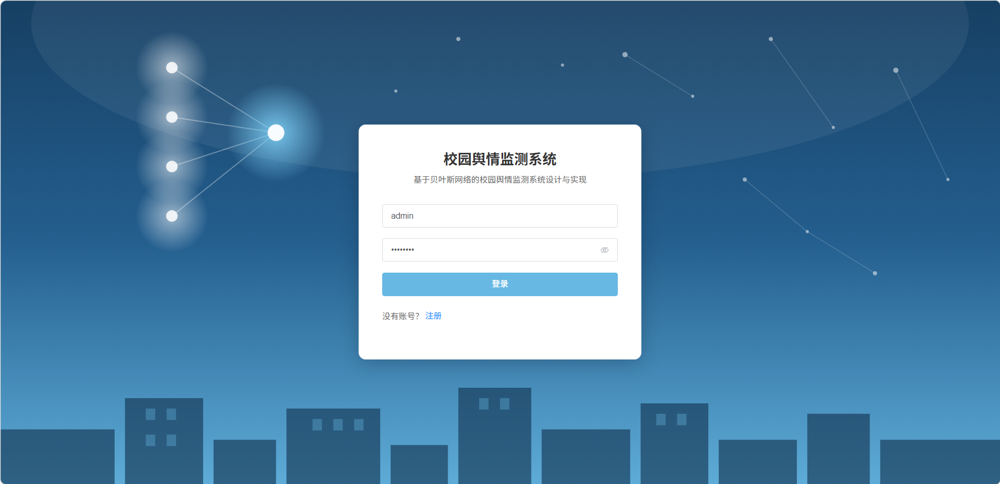
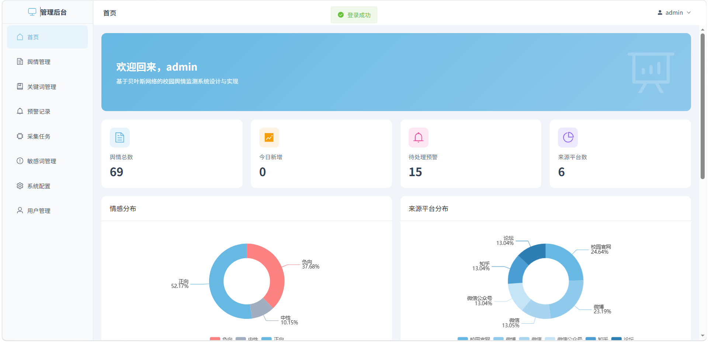
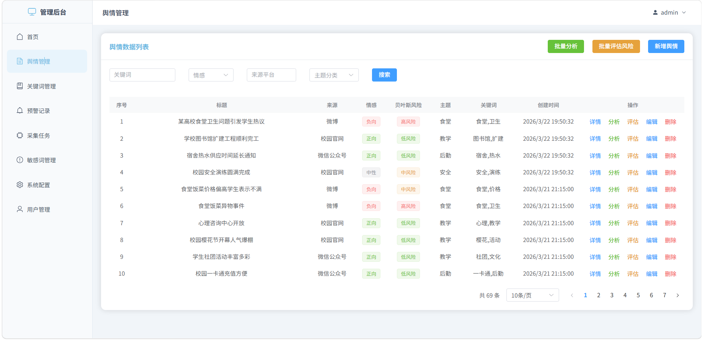
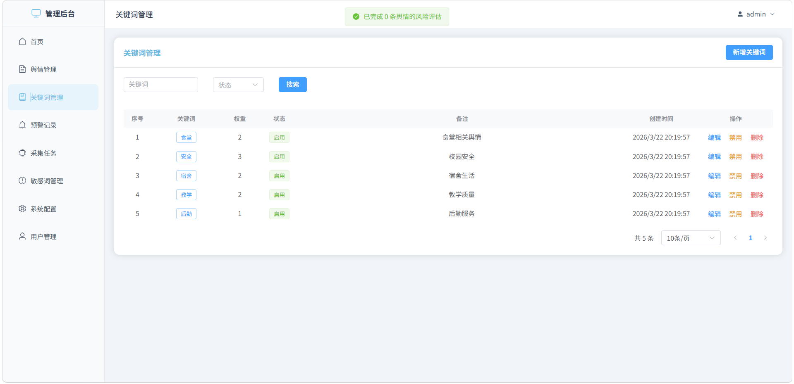 
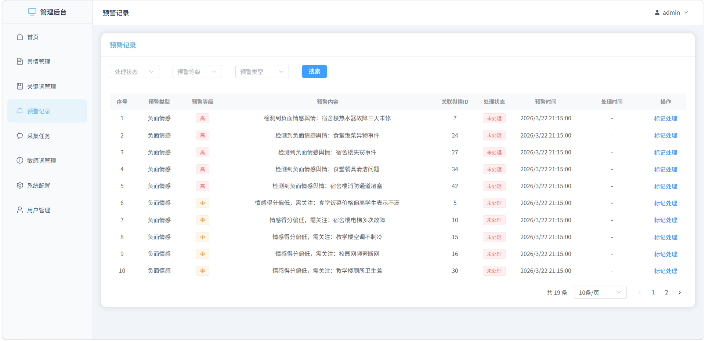
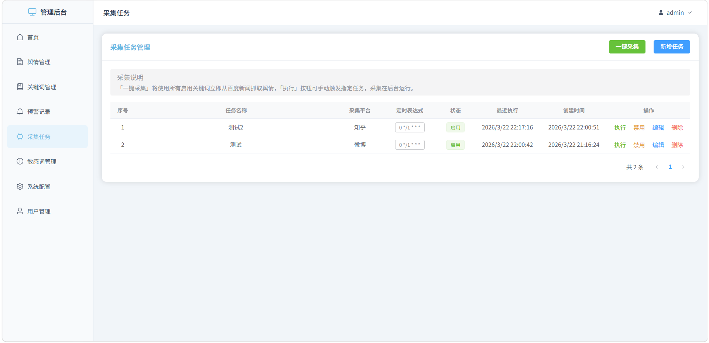
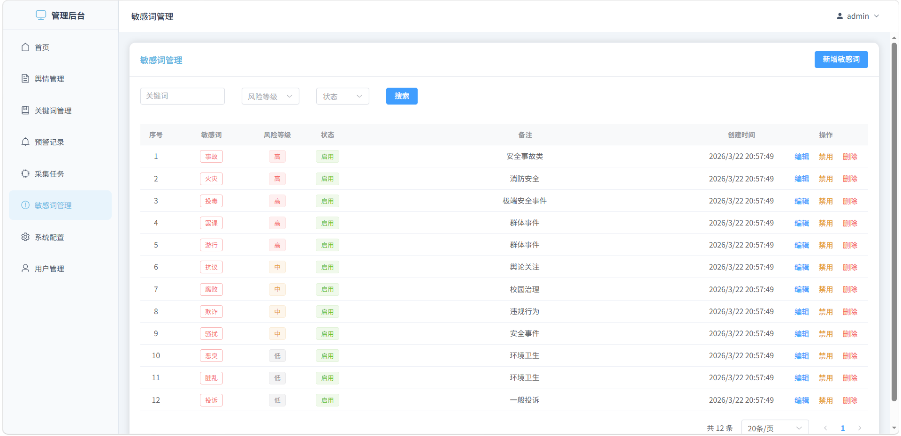
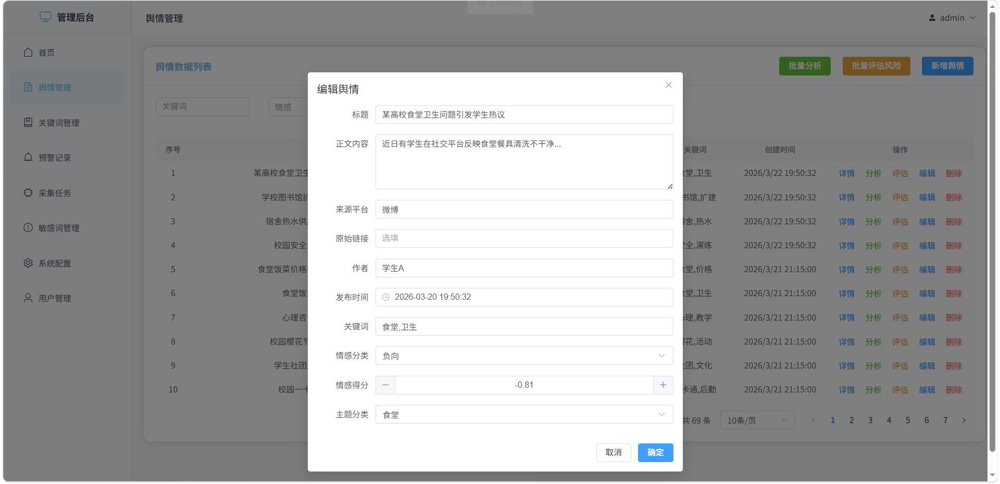
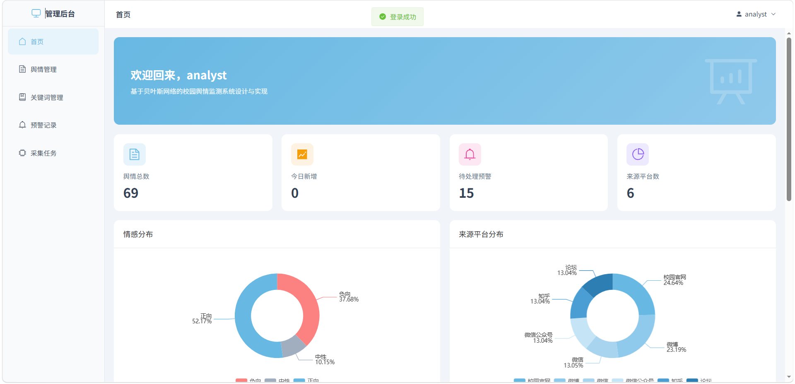
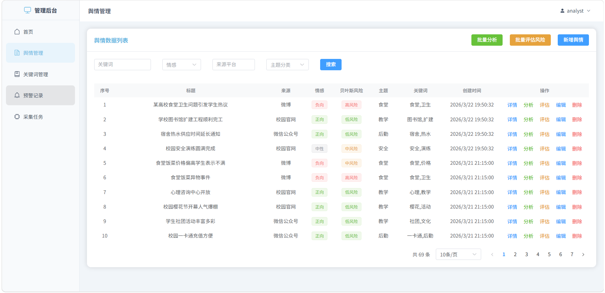
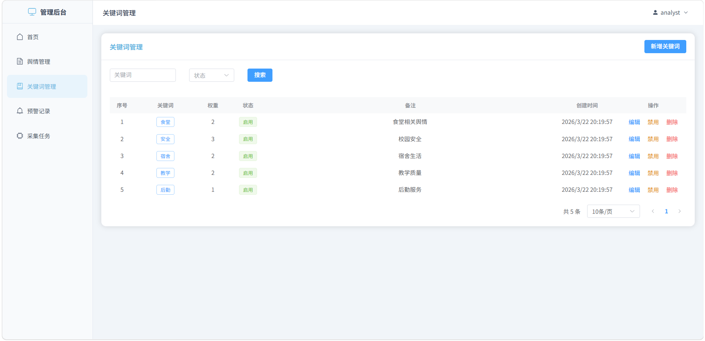
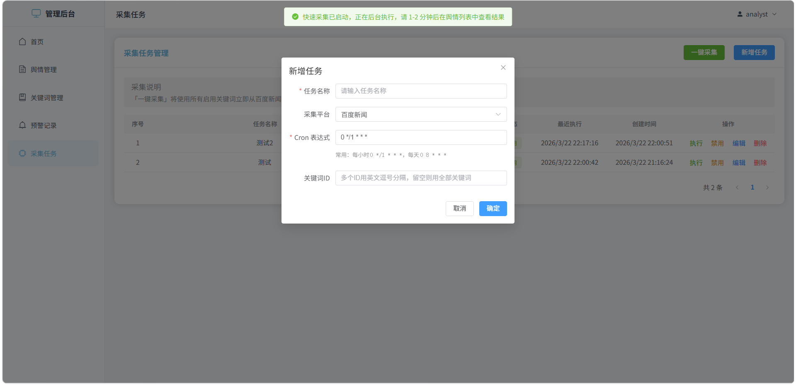

#### 常见问题

1、数据库连接失败：检查 MySQL 是否启动，确认 `backend/app/core/database.py` 中数据库名、账号、密码是否正确。

2、SQL 导入后没有表：请确认 `campus_opinion.sql` 已真正导入 `campus_opinion` 数据库，而不是仅创建了空库。

3、前端构建失败：请检查 Node.js 版本，建议使用 `Node.js 18` 或 `Node.js 20`，避免高版本导致的兼容问题。

4、登录提示“用户名或密码错误”：请确认已执行 SQL 初始化脚本且使用了正确的默认账号密码；若账号已被禁用，请联系管理员启用。

5、舆情数据为空：请先在管理端添加监控关键词并配置采集任务，或手动触发任务执行；采集依赖外网访问百度新闻，需确保网络可用。
